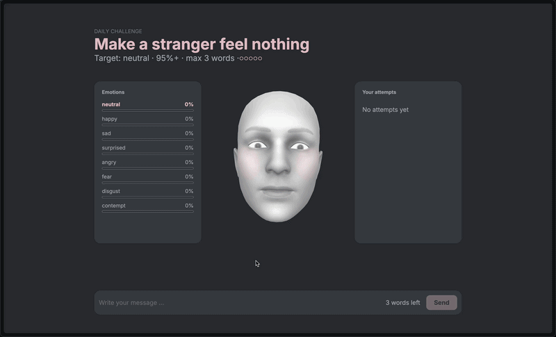

# how'd they feel?

  A daily word game where you write a short message and a 3D face reacts to how the recipient would feel reading it.

**Play it:** [howdtheyfeel.vercel.app](https://howdtheyfeel.vercel.app)

## How to play?
  Every day there´s a new challenge, like *"Make your mom proud"* or *"Scare your coworker"*.

  - Write a message within the word limit.
  - The face reacts live while you type.
  - You have 5 attempts to reach the target emotion.
  - A new challenge appears every day at midnight. 

## Built with
  - React + TypeScript + Vite
  - three.js for the 3D face
  - [Jev by TypeSafe AI](https://typesafe.ai) via Vercel AI Gateway for emotion analysis
  - Designed in Figma

## Run locally
  ```bash
  npm install
  vercel link
  vercel dev
  ```

## Credits
  - 3D face model: Face Cap by Bannaflak, from the three.js examples
  - Based on the three.js [morph targets – face](https://threejs.org/examples/#webgl_morphtargets_face) example
  - Emotion analysis by [Jev](https://typesafe.ai)